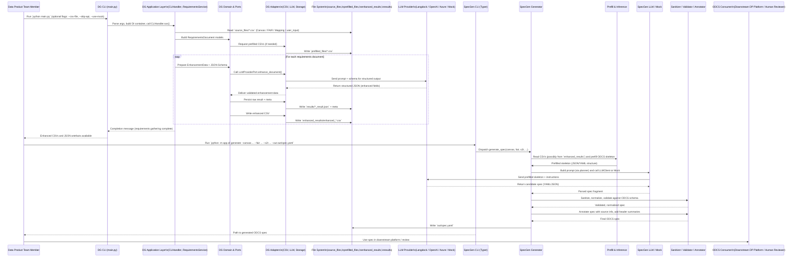

# Architecture Overview – AI-First Requirements & Spec Platform

This repo is a **monorepo** for an AI-assisted data product design platform.

At a high level:

- **`data-gathering-requirements/`**  
  CLI + hexagonal architecture to:
  - take **Canvas / FAIR / Mapping CSV templates** (plus optional user input CSV),
  - **prefill** them,
  - call an **LLM** (Langdock / OpenAI / Azure / Mock),
  - and emit **enhanced CSVs + JSON results**.

- **`spec-generator/`**  
  CLI + structured AI pipeline to:
  - take **(enhanced) Canvas / FAIR / S2T CSVs**,
  - prefill an **ODCS v3.0.2 contract skeleton**,
  - invoke an **LLM or mock** to fill gaps,
  - sanitize, validate and emit a **YAML Data Contract**.

Together they form:

> “CSV templates + LLMs → AI-first requirements → AI-first ODCS spec”

We’ll use **C4 Level 1–3** plus a **sequence diagram** to describe this.

- **C4 Level 1:** System context  
- **C4 Level 2:** Containers (main apps + external systems)  
- **C4 Level 3:** Components inside each app (no full L4; you can infer that from code)  

---

## C4 Level 1 – System Context

This shows how the overall platform sits relative to people and external systems.

```mermaid
graph TD

    subgraph People
      U["Data Product Team\n(BA / PM / Architect / AI Eng)"]
    end

    subgraph Platform["AI-First Requirements & Spec Platform (This Repo)"]
      S1["Data Gathering\nRequirements Service"]
      S2["Spec Generator\nService"]
    end

    subgraph External
      SRC["Source Knowledge\n(Existing Docs, Domain SMEs)"]
      CSV["CSV Storage\n(Git / Shared Drive)"]
      LLM["LLM Providers\n(Langdock / OpenAI / Azure / Mock)"]
      ODCS["ODCS Standards & Tooling\n(Schema, Validators, Downstream DP Platform)"]
      EVAL["Evaluation Stack\n(Deepeval / Test Harness)"]
    end

    U -->|fills templates| CSV
    CSV -->|Canvas / FAIR / Mapping / S2T CSVs| S1
    CSV -->|Canvas / FAIR / S2T CSVs| S2

    SRC -->|Domain knowledge via prompts / examples| S1
    SRC -->|Domain knowledge via prompts| S2

    S1 -->|LLM calls (structured JSON)| LLM
    S2 -->|LLM calls (structured YAML/JSON)| LLM

    S1 -->|Enhanced CSVs + JSON results| CSV
    S2 -->|ODCS YAML Specs| ODCS

    S1 -->|Eval metrics / golden comparisons| EVAL
    S2 -->|Eval metrics / golden contracts| EVAL

    U -->|runs CLIs / reviews outputs| S1
    U -->|runs CLIs / reviews specs| S2
```

**Key takeaways:**

* The repo is **not** a long-running service; it’s **CLI tools** that sit between human teams, CSV artefacts, and LLM providers.
* Everything revolves around **structured IO**: CSV ⇄ JSON ⇄ YAML.
* Evaluation is first-class but optional (Deepeval, golden specs).

---

## C4 Level 2 – Container Diagram

Now we zoom into the internal containers inside this “platform”.

```mermaid
graph TD

    U["Data Product Team\n(CLI user)"]

    subgraph DG["Container: data-gathering-requirements"]
      DG_CLI["CLI Entry (main.py)"]
      DG_APP["Application Services\n(RequirementsService, CLIHandler)"]
      DG_DOMAIN["Domain Layer\n(Models, Ports, Schema Services)"]
      DG_ADAPTERS["Adapters\n(CSV, LLM, Storage, Evaluation)"]
      DG_INF["Infrastructure\n(DI Container, Config, Logging)"]
    end

    subgraph SG["Container: spec-generator"]
      SG_CLI["Typer CLI\n(app/cli.py)"]
      SG_GEN["Generator Orchestrator\n(generator.py)"]
      SG_PREFILL["Prefill & Inference\n(prefill.py, field/metadata_inference.py)"]
      SG_PLANNER["Planner & Prompts\n(planner.py, prompts/)"]
      SG_LLM["LLM Client / Mock\n(llm.py, mock_generator.py)"]
      SG_POST["Sanitizer & Validator\n(sanitizer.py, validator.py, schema_utils.py)"]
      SG_ANN["Source Tracking & Annotation\n(yaml_annotator.py, source_tracker.py)"]
      SG_IO["IO & Config\n(io.py, config_loader.py, odcs_config.py)"]
    end

    subgraph FS["File System / Storage"]
      SRC_CSV[source_files/*.csv]
      PREF_CSV[prefilled_files/*.csv]
      ENH_CSV[enhanced_results/enhanced_*.csv]
      RES_JSON[results/*_result.json + meta]
      SPEC_YAML[out/*.yaml]
      EXAMPLES[examples/*.csv, spec_schema.json]
    end

    subgraph LLMs["LLM Providers"]
      L1[Langdock]
      L2[OpenAI / Azure OpenAI]
      L3[Mock Provider]
    end

    subgraph Eval["Evaluation Stack"]
      EV1[Deepeval]
      EV2[Test Suite (pytest)]
    end

    U --> DG_CLI
    U --> SG_CLI

    DG_CLI --> DG_INF
    DG_INF --> DG_APP
    DG_APP --> DG_DOMAIN
    DG_DOMAIN --> DG_ADAPTERS

    DG_ADAPTERS --> SRC_CSV
    DG_ADAPTERS --> PREF_CSV
    DG_ADAPTERS --> ENH_CSV
    DG_ADAPTERS --> RES_JSON

    DG_ADAPTERS --> L1
    DG_ADAPTERS --> L2
    DG_ADAPTERS --> L3

    DG_ADAPTERS --> EV1
    DG_ADAPTERS --> EV2

    SG_CLI --> SG_IO
    SG_CLI --> SG_GEN

    SG_GEN --> SG_PREFILL
    SG_GEN --> SG_PLANNER
    SG_GEN --> SG_LLM
    SG_GEN --> SG_POST
    SG_GEN --> SG_ANN

    SG_PREFILL --> SRC_CSV
    SG_PREFILL --> ENH_CSV
    SG_LLM --> L1
    SG_LLM --> L2
    SG_LLM --> L3

    SG_POST --> SPEC_YAML
    SG_ANN --> SPEC_YAML

    SG_POST --> EV2
```

**Key container-level ideas:**

* `data-gathering-requirements` is a **fully hexagonal LLM pipeline**.
* `spec-generator` is a **structured generator pipeline** with a more classic layered design (on its way to hexagonal).
* The **filesystem** is the contract between the two: `enhanced_results/*.csv` feeds into `spec-generator` (or you can bypass DG and use your own CSVs).

---

## C4 Level 3 – Components (Data-Gathering Service)

This focuses on the **hexagonal architecture** in `data-gathering-requirements`.

```mermaid
graph TB

    subgraph Entry
      MAIN[main.py]
      CLI_HANDLER["CLIHandler\n(application/services/cli_handler.py)"]
    end

    subgraph AppLayer["Application Layer"]
      REQ_SERVICE["RequirementsService\n(application/services/requirements_service.py)"]
    end

    subgraph Domain["Domain Layer"]
      MODELS["Models\n(RequirementsDocument,\nEnhancementData,\nProcessingResult,\nValidationResult)"]
      PORTS["Ports (Interfaces)\n(LLMProvider, DataSource,\nDataSink, StorageProvider,\nRequirementsRepository,\nMetadataRepository, EvaluatorPort)"]
      SCHEMA_SVC["Schema & Validation Services\n(schema_repository, schema_validator)"]
      UTILS["Helpers\n(TextNormalizer,\nFewShotExamples,\nContextFileResolver)"]
    end

    subgraph Adapters["Adapters Layer"]
      subgraph DataAdapters
        CSV_SRC["CSVDataSource\n(csv_data_source.py)"]
        CSV_SINK["CSVDataSink\n(csv_data_sink.py)"]
        CSV_REPO["CSVRequirementsRepository\n(csv_requirements_repository.py)"]
      end

      subgraph LLMAdapters
        AD_LANGDOCK[LangdockAdapter]
        AD_OPENAI[OpenAIAdapter]
        AD_AZURE[AzureAdapter]
        AD_MOCK[MockLangdockAdapter]
      end

      subgraph StorageAdapters
        FS_STORAGE[FilesystemStorage]
        FS_META[FilesystemMetadataRepository]
      end

      subgraph EvalAdapters
        DEEPEVAL[DeepevalAdapter]
      end
    end

    subgraph Infra["Infrastructure"]
      DI_CONTAINER["DI Container\n(infrastructure/container.py)"]
      CFG["Config\n(config.py)"]
      LOG["Logging\n(logging_config.py)"]
      TOKENS["TokenTracker\n(token_tracker.py)"]
    end

    MAIN --> DI_CONTAINER
    DI_CONTAINER --> CLI_HANDLER
    DI_CONTAINER --> REQ_SERVICE
    DI_CONTAINER --> CSV_SRC
    DI_CONTAINER --> CSV_SINK
    DI_CONTAINER --> CSV_REPO
    DI_CONTAINER --> FS_STORAGE
    DI_CONTAINER --> FS_META
    DI_CONTAINER --> AD_LANGDOCK
    DI_CONTAINER --> AD_OPENAI
    DI_CONTAINER --> AD_AZURE
    DI_CONTAINER --> AD_MOCK
    DI_CONTAINER --> DEEPEVAL
    DI_CONTAINER --> CFG
    DI_CONTAINER --> LOG
    DI_CONTAINER --> TOKENS

    CLI_HANDLER --> REQ_SERVICE

    REQ_SERVICE --> MODELS
    REQ_SERVICE --> PORTS
    REQ_SERVICE --> SCHEMA_SVC
    REQ_SERVICE --> UTILS

    PORTS --> CSV_SRC
    PORTS --> CSV_SINK
    PORTS --> CSV_REPO
    PORTS --> FS_STORAGE
    PORTS --> FS_META
    PORTS --> AD_LANGDOCK
    PORTS --> AD_OPENAI
    PORTS --> AD_AZURE
    PORTS --> AD_MOCK
    PORTS --> DEEPEVAL

    CSV_SRC -->|read templates / prefilled| MODELS
    CSV_SINK -->|write enhanced CSVs| MODELS
    FS_STORAGE -->|write raw JSON / meta| MODELS
    AD_LANGDOCK -->|structured LLM output| MODELS
    AD_OPENAI -->|structured LLM output| MODELS
    AD_AZURE -->|structured LLM output| MODELS
    AD_MOCK -->|deterministic mock output| MODELS
```



**Mental model:**

* **Domain** contains all the contracts and business rules. It depends on **ports only**.
* **Adapters** implement those ports for CSV, filesystem, LLMs, evaluation.
* **Infra** wires everything via a DI container; `main.py` is strictly a thin composition root.
* You can safely:

  * add a new LLM provider by writing one adapter,
  * change how you store results by swapping storage adapters,
  * or test everything with `MockLangdockAdapter`.

---

## C4 Level 3 – Components (Spec Generator)

Now we crack open `spec-generator/src/app`.

```mermaid
graph TB

    subgraph CLI["CLI Layer"]
      TYPER["Typer CLI\n(cli.py)"]
    end

    subgraph Orchestration
      GEN["Generator\n(generator.py)"]
      VALIDATE_CMD["validate_spec command\n(validate_spec.py)"]
      INPUT_VALIDATE["Input Completeness\n(input_validator.py)"]
    end

    subgraph PrefillLayer["Prefill & Inference"]
      PREFILL["prefill.py\n(CSV → skeleton prefill)"]
      PREFILL_ISO["prefill_isolate.py\n(focused prefill ops)"]
      FIELD_INF["field_inference.py\n(column-level inference)"]
      META_INF["metadata_inference.py\n(dataset metadata inference)"]
      STRUCT_TRANS[structure_transformer.py]
      SLA_TRANS[sla_transformer.py]
      EXT_TRANS[extensions_transformer.py]
    end

    subgraph Prompting
      PLANNER["planner.py\n(prompt builder)"]
      PROMPTS["prompts/*\n(domain, persona, instructions)"]
    end

    subgraph LLMBlock["LLM / Mock"]
      LLM_CLIENT["LLMClient\n(llm.py)"]
      MOCK_GEN["MockGenerator\n(mock_generator.py)"]
    end

    subgraph PostProcess["Sanitize / Validate / Annotate"]
      SANITIZER[sanitizer.py]
      SCHEMA_UTILS["schema_utils.py\n(JSON Schema → skeleton)"]
      VALIDATOR[validator.py]
      SRC_TRACK[source_tracker.py]
      YAML_ANN[yaml_annotator.py]
    end

    subgraph IOConfig["IO & Config"]
      IO["io.py\n(CSV IO, JSON helpers)"]
      CFG_LOADER[config_loader.py]
      APP_CFG["config.py, storage_config.py, odcs_config.py"]
      ODCS_MODELS[odcs_models.py]
    end

    subgraph Evaluation["Evaluation (optional)"]
      EVAL_TOOL[evaluation/eval_tool.py]
      SCHEMA_EVAL[evaluation/schema_eval.py]
    end

    TYPER --> GEN
    TYPER --> INPUT_VALIDATE
    TYPER --> VALIDATE_CMD

    GEN --> IO
    GEN --> PREFILL
    GEN --> PLANNER
    GEN --> LLM_CLIENT
    GEN --> MOCK_GEN
    GEN --> SANITIZER
    GEN --> SCHEMA_UTILS
    GEN --> VALIDATOR
    GEN --> YAML_ANN
    GEN --> SRC_TRACK
    GEN --> APP_CFG

    PREFILL --> FIELD_INF
    PREFILL --> META_INF
    PREFILL --> STRUCT_TRANS
    PREFILL --> SLA_TRANS
    PREFILL --> EXT_TRANS

    PLANNER --> PROMPTS
    SCHEMA_UTILS --> APP_CFG
    SANITIZER --> APP_CFG
    VALIDATOR --> SCHEMA_UTILS
    YAML_ANN --> SRC_TRACK
    VALIDATE_CMD --> VALIDATOR
    VALIDATE_CMD --> SCHEMA_UTILS

    EVAL_TOOL --> IO
    EVAL_TOOL --> SCHEMA_EVAL
    EVAL_TOOL --> SPEC[YAML Specs / Golden Specs]
```



**Mental model of the spec generator:**

* **Typer CLI (`cli.py`)**: user-facing commands – `generate`, `validate-spec`, `validate-inputs`, `eval`, etc.
* **Generator orchestrator (`generator.py`)**: the main pipeline:

  1. Load JSON Schema → build ODCS skeleton.
  2. Read CSVs (Canvas / FAIR / S2T) via `io.py`.
  3. Prefill skeleton from CSVs (`prefill.py` + inference helpers).
  4. Build prompts via `planner.py` and `prompts/*`.
  5. Call `LLMClient` (or `MockGenerator`).
  6. Sanitize + normalize + validate against schema.
  7. Annotate spec with field sources and summaries.
  8. Emit final ODCS YAML spec.
* **Validation flows**:

  * Input validation: ensure CSVs are well-formed before wasting tokens.
  * Spec validation: ensure ODCS spec passes schema and internal rules.
* **Evaluation**: optional but integrated, using golden specs and quality metrics.

---

## Main Use Case – Sequence Diagram

This is the **end-to-end flow** from a user’s perspective, combining both apps.



**Reading this sequence:**

* Phase 1 is the hexagonal pipeline focused on **requirements enrichment**.
* Phase 2 is the spec pipeline focused on **ODCS-compliant contract generation**.
* The bridge is the **`enhanced_results/enhanced_*.csv`** files.

---

## How to Use This Doc Practically

When you go into KT:

1. **Start at Level 1** – describe in your own words how this platform sits between people, CSVs, and LLM providers.
2. **Use Level 2** to talk about responsibilities:

   * “This container owns requirements gathering; this one owns ODCS spec generation.”
3. **Use the Level 3 diagrams** to:

   * ask precise questions about extension points (e.g., “I see LLM adapters here; what invariants do they respect?”),
   * and to anchor code browsing (e.g., “let’s open `generator.py` and find where it calls `prefill.py` and `llm.py`”).
4. **Use the sequence diagram** when you want to reason about:

   * where failures can occur,
   * where you might add logging, metrics, or additional validation,
   * and how to parallelize or scale.

