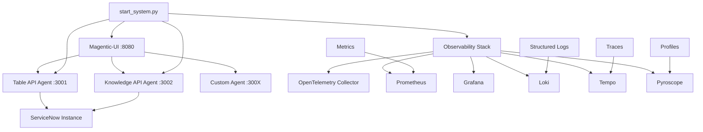

#  ServiceNow MCP System Architecture

## Overview

The ServiceNow MCP System is designed as a modular, scalable, and observable integration platform that connects ServiceNow APIs with AI agents through the Model Context Protocol (MCP).

## System Architecture



## Core Components

### 1. Entry Point (`start_system.py`)
- **Purpose**: Single command system orchestration
- **Responsibilities**:
  - Auto-discover MCP agents in `mcp_agents/` folder
  - Start observability stack
  - Launch Magentic-UI with proper configuration
  - Health monitoring and graceful shutdown
  - Signal handling and cleanup

### 2. MCP Agents (`mcp_agents/`)
- **Architecture**: Server-Sent Events (SSE) based
- **Auto-Discovery**: Scripts automatically detected and started
- **Current Agents**:
  - `servicenow_table_sse_server.py`: Table API operations
  - `servicenow_knowledge_sse_server.py`: Knowledge Management

### 3. Magentic-UI Interface
- **Port**: 8080
- **Configuration**: `servicenow_final_config.yaml`
- **Features**:
  - Multi-agent orchestration
  - Real-time communication via SSE
  - Built-in agents (web_surfer, coder_agent, file_surfer)
  - Custom ServiceNow agents

### 4. Observability Stack (`observability.py`)
- **OpenTelemetry**: Distributed tracing and metrics
- **Structured Logging**: JSON logs with trace correlation
- **Prometheus**: Metrics collection
- **Health Monitoring**: Endpoint and process checks

## Communication Flow

### 1. Agent Discovery and Startup
```python
# start_system.py discovers agents
mcp_agents_dir = Path("mcp_agents")
agents = discover_mcp_agents()  # *.py files

# Each agent started as subprocess
for agent in agents:
    subprocess.Popen(["uv", "run", "python", agent])
```

### 2. SSE Communication
```python
# MCP Agent (Server)
from fastmcp import FastMCP
mcp = FastMCP("ServiceNow Table API")

@mcp.tool()
def get_records(table: str, query: str) -> dict:
    # ServiceNow API call
    return results

# SSE transport
mcp.run(transport="sse", host="localhost", port=3001)
```

### 3. Magentic-UI Integration
```yaml
# servicenow_final_config.yaml
mcp_agent_configs:
  - name: servicenow_table_agent
    mcp_servers:
      - server_name: ServiceNow_Table_API
        server_params:
          type: SseServerParams
          url: "http://localhost:3001/sse"
```

## Data Flow

### 1. User Request Flow
```
User Input (Magentic-UI) 
     Agent Selection
     MCP Tool Invocation (SSE)
     ServiceNow API Call
     Response Processing
     UI Display
```

### 2. Observability Flow
```
Application Event
     Structured Log (JSON)
     OpenTelemetry Trace
     Prometheus Metric
     Storage (Loki/Tempo/Prometheus)
     Grafana Visualization
```

## Security Architecture

### 1. Credential Management
- **Environment Variables**: Secure credential storage
- **No Hardcoded Secrets**: All sensitive data externalized
- **ServiceNow Authentication**: Username/password or OAuth

### 2. Network Security
- **Local Binding**: Services bind to localhost only
- **Port Isolation**: Each service on dedicated port
- **SSE Security**: Secure Server-Sent Events

### 3. Process Isolation
- **Separate Processes**: Each MCP agent runs independently
- **Graceful Shutdown**: Proper signal handling
- **Resource Limits**: Memory and CPU constraints

## Scalability Considerations

### 1. Horizontal Scaling
- **Agent Replication**: Multiple instances per agent type
- **Load Balancing**: Round-robin agent selection
- **Service Discovery**: Dynamic agent registration

### 2. Performance Optimization
- **Connection Pooling**: ServiceNow API connections
- **Caching**: Response caching for frequent queries
- **Async Processing**: Non-blocking I/O operations

### 3. Resource Management
- **Memory Monitoring**: Automatic garbage collection
- **Log Rotation**: Prevents disk space issues
- **Health Checks**: Automatic restart on failure

## Extension Points

### 1. Adding New MCP Agents
```python
# mcp_agents/custom_agent.py
from fastmcp import FastMCP

mcp = FastMCP("Custom Agent")

@mcp.tool()
def custom_operation(param: str) -> str:
    # Custom logic
    return result

if __name__ == "__main__":
    mcp.run(transport="sse", host="localhost", port=3003)
```

### 2. Custom Observability
```python
# Custom metrics
from observability import get_logger, create_counter

logger = get_logger()
counter = create_counter("custom_operations_total")

def custom_function():
    counter.inc()
    logger.info("custom_operation_executed")
```

### 3. Configuration Extensions
```yaml
# Add to servicenow_final_config.yaml
mcp_agent_configs:
  - name: custom_agent
    description: "Custom functionality"
    mcp_servers:
      - server_name: Custom_Agent
        server_params:
          type: SseServerParams
          url: "http://localhost:3003/sse"
```

## Deployment Architecture

### 1. Development
- **Single Machine**: All components on localhost
- **File-based Logs**: Local log files
- **SQLite Database**: Magentic-UI storage

### 2. Production (Recommended)
- **Container Orchestration**: Docker/Kubernetes
- **External Databases**: PostgreSQL for Magentic-UI
- **Centralized Logging**: ELK/LGTM stack
- **Load Balancers**: HAProxy/NGINX
- **Service Mesh**: Istio for microservices

### 3. High Availability
- **Multi-Instance Deployment**: Redundant services
- **Health Check Endpoints**: Kubernetes probes
- **Circuit Breakers**: Fault tolerance
- **Backup Strategies**: Data and configuration backup

## Monitoring and Alerting

### 1. Key Metrics
- **Request Rate**: Requests per second per agent
- **Response Time**: P95/P99 latencies
- **Error Rate**: 4xx/5xx error percentages
- **Resource Usage**: CPU/Memory/Disk utilization

### 2. Alert Conditions
- **Service Down**: Health check failures
- **High Error Rate**: >5% error rate
- **High Latency**: >2s response times
- **Resource Exhaustion**: >80% resource usage

### 3. Dashboards
- **System Overview**: All services status
- **Agent Performance**: Per-agent metrics
- **ServiceNow Integration**: API call patterns
- **User Experience**: End-to-end request flows

## Future Enhancements

### 1. Advanced Features
- **Multi-tenant Support**: Isolated ServiceNow instances
- **Workflow Orchestration**: Complex multi-step operations
- **Real-time Collaboration**: Multiple user sessions
- **Advanced Security**: RBAC and audit logging

### 2. Performance Improvements
- **GraphQL API**: Efficient data fetching
- **WebSocket Support**: Bi-directional communication
- **Edge Caching**: CDN for static assets
- **Database Optimization**: Query performance tuning

### 3. Integration Expansions
- **Multiple ServiceNow Instances**: Cross-instance operations
- **Third-party Integrations**: Slack, Teams, JIRA
- **Custom Connectors**: Plugin architecture
- **API Gateway**: Centralized API management

This architecture provides a solid foundation for scalable, maintainable, and observable ServiceNow integrations while maintaining simplicity and ease of use.